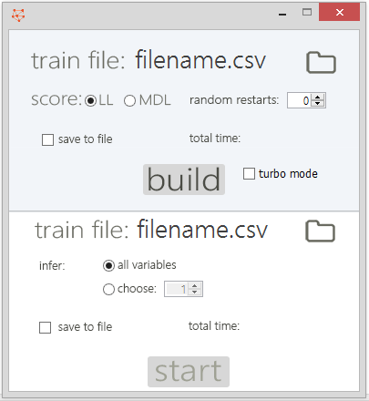

# Bayesian Network Creator
A Java project that can build bayesian networks and make predictions based on the resulting network.
(The provided [.jar file](java/BN.jar) in the java/ folder was made for Java 1.8)

The data is read from .csv files (you can see some examples on the project's root folder)

We also provide a simple GUI:

